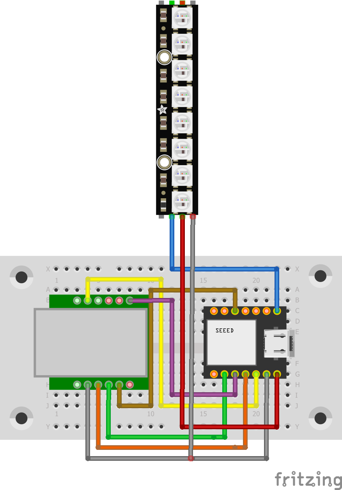
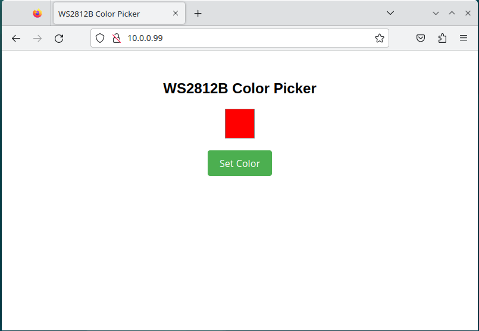

# LUKI-LED
## parts
* [Seeeduino-XIAO](https://wiki.seeedstudio.com/Seeeduino-XIAO/)
* [W5500 Ethernet Network Module SPI to LAN TCP IP STM32 Interface](https://www.amazon.de/Hailege-Ethernet-Network-Interface-WIZ820io/dp/B0B775X737)
* [NeoPixel Stick – 8 x WS2812 5050 RGB LED](https://www.berrybase.de/en/neopixel-stick-mit-8-ws2812-5050-rgb-leds)
* [breadboard]()
* some cables

## pictures

## cabeling
| Seeeduino-XIAO | W5500 Ethernet Module | NeoPixel Stick |
| ------------- | ------------- | ------------- |
| 5V  | | VCC  |
| Ground  | G  | GND  |
| 3V3 | VIN3.3
| 10 (MOSI) | MOSI
| 9 (MISO) | MISO
| 8 (SCK) | SCLK/SCK
| 4 (SDA) | nSS/CS
| 0 | | IN

## control
### webserver
For controlling the stripe over the webserver, just use the IP set in the top of the code and you get the following page:<br>

### GET-requests
The secound way is to control the stripe via GET-requests with the following URL-parameters:
```
http://10.0.0.99/?red=255&green=255&blue=255
```
If one parameter is not set it uses the value 0 as default.